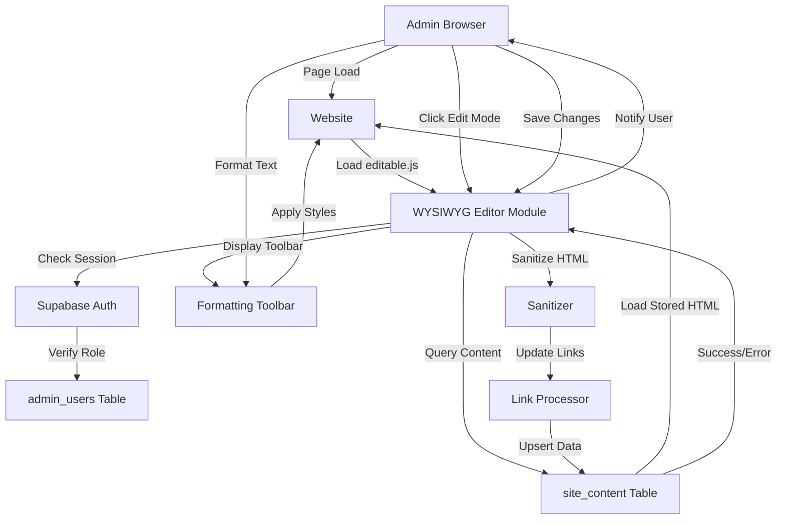

# WYSIWYG Content Editor - Technical Design Document

## Overview

The WYSIWYG (What You See Is What You Get) Content Editor is a client-side editing system that empowers authenticated administrators to edit website content in-place with a visual formatting toolbar. The system persists changes to Supabase, synchronizes shared elements across pages, and provides real-time visual feedback during editing sessions.

**Key Features:**
- Inline content editing with instant visual feedback
- Rich text formatting toolbar (bold, italic, underline, colors, alignment, etc.)
- Persistent storage in Supabase with per-user audit trails
- Cross-page content synchronization for shared elements
- Undo/redo functionality with 50-change history
- Mobile-responsive touch-friendly interface
- Security-hardened HTML sanitization to prevent XSS attacks
- Session-based edit mode that persists across navigation

## Architecture

### High-Level System Design



### Component Architecture

```
┌─────────────────────────────────────────────────────────────┐
│                    WYSIWYG Editor Module                     │
├─────────────────────────────────────────────────────────────┤
│                                                               │
│  ┌──────────────┐  ┌──────────────┐  ┌──────────────┐       │
│  │  Auth Layer  │  │  State Mgmt  │  │  DOM Parser  │       │
│  └──────────────┘  └──────────────┘  └──────────────┘       │
│         │                 │                 │                │
│  ┌─────────────────────────────────────────────────┐         │
│  │  Edit Mode Controller                           │         │
│  │  - Toggle edit mode                             │         │
│  │  - Track edit state in sessionStorage           │         │
│  │  - Manage focus and blur events                 │         │
│  └─────────────────────────────────────────────────┘         │
│         │                                                    │
│  ┌─────────────────────────────────────────────────┐         │
│  │  UI Layer                                       │         │
│  │  - Edit mode toggle button                      │         │
│  │  - Formatting toolbar                           │         │
│  │  - Visual indicators (outlines, focus states)   │         │
│  │  - Notification system                          │         │
│  └─────────────────────────────────────────────────┘         │
│         │                                                    │
│  ┌─────────────────────────────────────────────────┐         │
│  │  Content Layer                                  │         │
│  │  - Element detection & key generation           │         │
│  │  - Content loading from Supabase                │         │
│  │  - Undo/redo history management                 │         │
│  │  - Change tracking                              │         │
│  └─────────────────────────────────────────────────┘         │
│         │                                                    │
│  ┌─────────────────────────────────────────────────┐         │
│  │  Data Layer                                     │         │
│  │  - HTML sanitization                            │         │
│  │  - Link attribute updates (tel:, mailto:)       │         │
│  │  - Supabase API communication                   │         │
│  │  - Change persistence                           │         │
│  └─────────────────────────────────────────────────┘         │
│                                                               │
└─────────────────────────────────────────────────────────────┘
```

## Components and Interfaces

### 1. Auth Layer

**Responsibilities:**
- Verify Supabase session on module load
- Query admin_users table for role verification
- Enable/disable editing based on authorization

**Interface:**
```javascript
class AuthLayer {
  async verifySession() // Returns boolean
  async getUserRole() // Returns 'admin'|'super_admin'|'editor'|null
  async isAuthorized() // Returns boolean
  getCurrentUserEmail() // Returns string
}
```

### 2. Edit Mode Controller

**Responsibilities:**
- Toggle edit mode on/off
- Persist edit mode state to sessionStorage
- Manage contentEditable state on all elements
- Restore edit mode state on page navigation

**Interface:**
```javascript
class EditModeController {
  async activateEditMode() // void
  async deactivateEditMode() // void
  toggleEditMode() // void
  isEditModeActive() // Returns boolean
  persistEditModeState() // void
  restoreEditModeState() // void
}
```

### 3. DOM Parser & Element Detection

**Responsibilities:**
- Scan page for editable elements using CSS selectors
- Exclude navigation, footer, and toolbar elements
- Generate unique content keys (page:index format)
- Assign data-editable attributes

**Selectors Used:**
```javascript
const editableSelector = 'h1,h2,h3,h4,p,li,td,th,.contact-item,.top-contacts span,.leader-contact span';
const excludeSelector = 'nav, footer, #edit-toolbar, script, style';
```

**Content Key Format:**
```
{pagePathname}:{elementIndex}
Examples:
  /index.html:0
  /pro-lyceum.html:5
  /kontakty.html:2
```

**Interface:**
```javascript
class DOMParser {
  detectEditableElements() // Returns Element[]
  generateContentKey(element, index) // Returns string
  assignContentKeys(elements) // void
  findElementByKey(key) // Returns Element|null
  getEditableElementsMap() // Returns Map<key, Element>
}
```

### 4. Content Loader

**Responsibilities:**
- Query site_content table for current page
- Match stored content to page elements
- Load and inject stored HTML into DOM
- Handle orphaned content (no matching element)

**Interface:**
```javascript
class ContentLoader {
  async loadPageContent(pagePath) // void
  async loadContentByKey(key) // Returns string|null
  async loadAllPageContent() // Returns Map<key, value>
  injectContentIntoElement(element, htmlContent) // void
}
```

### 5. Formatting Toolbar

**Responsibilities:**
- Create and position toolbar near focused element
- Provide formatting buttons for all styles
- Execute formatting commands
- Show/hide based on element focus state

**Toolbar Buttons:**
```
Row 1: Bold | Italic | Underline | Strikethrough
Row 2: Font Size ↑ | Font Size ↓
Row 3: Text Color [picker] | Highlight Color [picker]
Row 4: Align Left | Align Center | Align Right | Justify
```

**Interface:**
```javascript
class FormattingToolbar {
  render() // Returns HTMLElement
  show(anchorElement) // void
  hide() // void
  position(element) // void
  onBoldClick() // void
  onItalicClick() // void
  // ... other format methods
  executeCommand(command, value) // void
}
```

### 6. Undo/Redo Manager

**Responsibilities:**
- Track edit history per element (50-change max)
- Execute undo/redo commands
- Restore previous states without database queries
- Preserve history when switching elements

**History Entry:**
```javascript
{
  elementKey: string,
  previousHTML: string,
  newHTML: string,
  timestamp: number,
  operation: 'text_change' | 'formatting' | 'delete'
}
```

**Interface:**
```javascript
class UndoRedoManager {
  recordChange(elementKey, previousHTML, newHTML) // void
  undo() // void
  redo() // void
  canUndo() // Returns boolean
  canRedo() // Returns boolean
  clearHistory(elementKey) // void
  getHistory(elementKey) // Returns HistoryEntry[]
}
```

### 7. HTML Sanitizer

**Responsibilities:**
- Remove dangerous tags (script, iframe, object, embed)
- Remove event handlers (onclick, onload, etc.)
- Encode special characters in href/src
- Preserve safe formatting tags
- Log sanitization warnings

**Safe Tags Whitelist:**
```
strong, em, span, div, p, h1, h2, h3, h4, h5, h6,
ul, ol, li, br, a, u, s, small, sub, sup, mark, code, pre
```

**Interface:**
```javascript
class HTMLSanitizer {
  sanitize(htmlContent) // Returns string
  removeDangerousTags(html) // Returns string
  removeEventHandlers(html) // Returns string
  encodeAttributeValues(html) // Returns string
  validateTag(tagName) // Returns boolean
}
```

### 8. Link Processor

**Responsibilities:**
- Update tel: links when phone numbers are edited
- Update mailto: links when email addresses are edited
- Strip non-numeric characters from phone numbers
- Trim whitespace from email addresses

**Interface:**
```javascript
class LinkProcessor {
  updatePhoneLink(element, newPhoneText) // void
  updateEmailLink(element, newEmailText) // void
  extractPhoneNumber(text) // Returns string (digits only)
  extractEmailAddress(text) // Returns string (trimmed)
  processLinksAfterEdit(elements) // void
}
```

### 9. Content Synchronizer

**Responsibilities:**
- Identify elements shared across pages
- Update site_content for all page variants
- Distinguish page-specific vs. shared content

**Shared Element Types:**
```
- Footer contact information
- Header navigation (if applicable)
- Contact information blocks
- Repeated disclaimer/legal text
```

**Interface:**
```javascript
class ContentSynchronizer {
  identifySharedElements(element) // Returns string[] (page paths)
  synchronizeAcrossPages(key, htmlContent) // void
  updatePageVariant(pagePath, key, htmlContent) // void
  isSharedElement(elementKey) // Returns boolean
}
```

### 10. Save Manager

**Responsibilities:**
- Collect modified elements
- Prepare upsert payload
- Call Supabase API
- Handle errors and retries
- Notify user of save status

**Interface:**
```javascript
class SaveManager {
  async saveChanges(modifiedElements) // Returns {success, error}
  async prepareUpsertPayload(elements) // Returns UpsertRow[]
  async upsertToSupabase(rows) // Returns {success, error}
  async retryFailedSave(rows, maxRetries) // Returns {success, error}
  notifySuccess() // void
  notifyError(message) // void
}
```

## Data Models

### Database Schema: site_content Table

```sql
CREATE TABLE site_content (
  key TEXT PRIMARY KEY,
  page TEXT NOT NULL,
  value TEXT NOT NULL,
  updated_by TEXT NOT NULL,
  updated_at TIMESTAMPTZ NOT NULL DEFAULT now()
);
```

**Schema Details:**
- `key`: Unique identifier (format: /path/to/page.html:elementIndex)
- `page`: Current page path (e.g., /index.html, /pro-lyceum.html)
- `value`: HTML content stored for the element (innerHTML)
- `updated_by`: Admin email who made the change (audit trail)
- `updated_at`: Timestamp of last update

**Indexes:**
```sql
CREATE INDEX idx_site_content_page ON site_content(page);
CREATE INDEX idx_site_content_key ON site_content(key);
```

### Content Key Structure

Content keys uniquely identify editable elements across pages:

```
Format: {page_pathname}:{element_index}

Examples:
  /index.html:0        → First editable element on index.html
  /index.html:1        → Second editable element on index.html
  /pro-lyceum.html:3   → Fourth editable element on pro-lyceum.html
  
For root path (/), normalized to /index.html
```

### Edit History Entry (In-Memory)

```javascript
{
  elementKey: "/index.html:0",
  previousHTML: "<strong>Old Text</strong>",
  newHTML: "<strong>New Text</strong>",
  timestamp: 1702500000,
  operation: "text_change"
}
```

## Error Handling

### Authentication Errors

```javascript
// No session
→ Hide all editing controls
→ Silently disable module (no error shown to visitors)

// Invalid role
→ Hide all editing controls
→ Log warning in console (dev only)

// Session expired during edit
→ Disable save button
→ Show: "Session expired. Please refresh page."
```

### Content Loading Errors

```javascript
// Query fails
→ Log error in console
→ Continue with empty content (show defaults)
→ Don't disrupt page load

// Orphaned content (key matches no element)
→ Skip silently
→ Log warning in console
```

### Save Errors

```javascript
// Network error
→ Show: "Network error. Changes not saved."
→ Keep save button enabled for retry
→ Preserve in-memory changes

// Validation error (sanitization failed)
→ Show: "Content contains invalid data. Check and try again."
→ Preserve user's changes in UI
→ Don't save to database

// Permission denied
→ Show: "You don't have permission to save. Session may have expired."
→ Redirect to login after 5 seconds
```

### XSS Prevention Errors

```javascript
// Malicious tag detected
→ Remove tag
→ Log warning: "Malicious content removed: <script> tag"
→ Continue with sanitized content
→ Still save sanitized version
```

## Testing Strategy

### Unit Tests

**Format Application:**
- Test each formatting type (bold, italic, underline, color, etc.)
- Verify correct CSS/tag application
- Test with selected text vs. empty selection

**Element Detection:**
- Test selector matches all intended elements
- Test exclusion rules (nav, footer, toolbar)
- Test key generation uniqueness

**Undo/Redo:**
- Test undo reverts last change
- Test redo restores change
- Test history limit (50 changes)
- Test history preservation when switching elements

**HTML Sanitization:**
- Test dangerous tags are removed (script, iframe, etc.)
- Test safe tags are preserved (strong, em, etc.)
- Test event handlers are stripped
- Test attribute encoding

**Link Updates:**
- Test tel: link href update on phone number change
- Test mailto: link href update on email change
- Test phone number digit extraction
- Test email whitespace trimming

**State Management:**
- Test edit mode toggle
- Test sessionStorage persistence
- Test edit mode restoration on navigation
- Test auto-activate on page load

**Mobile Responsiveness:**
- Test toolbar compact layout on mobile
- Test button sizes (44x44 minimum)
- Test touch event handling
- Test keyboard accommodation

### Integration Tests

**Supabase Integration:**
- Test session verification flow
- Test role authorization
- Test content upsert operation
- Test error handling for failed saves

**Content Persistence:**
- Test content loads on page load
- Test content saves to database
- Test content loads after page reload
- Test orphaned content is ignored

**Cross-Page Sync:**
- Test shared element identification
- Test synchronization across pages
- Test page-specific content stays isolated
- Test updated content loads on all pages

### Property-Based Tests

**Element Detection:**
- For any valid text element in the selector list, it should be detected
- For any element inside excluded containers (nav, footer), it should NOT be detected
- For any set of elements, each should have a unique content key
- For duplicate content, elements should get different keys

**Edit Mode Activation:**
- For any authorized admin, edit mode toggle should be available
- For any editable element in edit mode, it should have contentEditable="true"
- For any element, all editable elements should have visual indicators when edit mode is active
- For any inactive edit mode, all elements should have contentEditable="false"

**Sanitization:**
- For any dangerous tag in HTML content, it should be removed
- For any safe tag in HTML content, it should be preserved
- For any event handler attribute, it should be removed
- For any special character in href/src, it should be encoded

**Link Processing:**
- For any phone number with non-numeric characters, digits should be extracted
- For any email address with whitespace, it should be trimmed
- For any tel: link with edited phone number, href should be updated
- For any mailto: link with edited email, href should be updated

**History Management:**
- For any sequence of edits to an element, history should contain all changes
- For more than 50 changes in history, oldest changes should be dropped
- For any undo operation, the previous state should be restored
- For any redo operation, the last undone state should be restored

**Change Persistence:**
- For any element with pending changes, changes should remain in DOM until save
- For any modified element, innerHTML should be extracted during save
- For any saved content, it should appear in site_content table
- For any page load after save, saved content should be displayed

## Frontend Implementation

### Module Loading

The editor loads via a single script tag in each page HTML:

```html
<script src="js/editable.js"></script>
```

### Initialization Sequence

```
1. Check if Supabase is available
   ├─ If not, exit silently (no error)
   └─ Continue
2. Get current page path
3. Detect editable elements
4. Assign content keys
5. Load stored content from database
6. Verify user session
   ├─ If no session, exit silently
   └─ Continue
7. Query user role from admin_users
   ├─ If not authorized, exit silently
   └─ Continue
8. Inject CSS for styling
9. Render edit toolbar
10. Attach event listeners
```

### Edit Mode State Management

**Session Storage Keys:**
```
editMode:active -> boolean (true/false)
editMode:timestamp -> number (when activated)
```

**Flow:**
```
1. User clicks toggle
2. toggleEditMode() called
3. editMode.active = !editMode.active
4. sessionStorage.setItem('editMode:active', editMode.active)
5. Add/remove 'edit-mode' class on body
6. Show/hide toolbar
7. On navigation, check sessionStorage
8. If active, automatically restore
9. On session end, clear sessionStorage
```

### CSS Architecture

The editor injects minimal CSS for maximum flexibility:

```css
/* Edit mode indicators */
body.edit-mode [data-editable] {
  outline: 2px dashed #2563eb;
  outline-offset: 3px;
  cursor: text;
}

body.edit-mode [data-editable]:focus {
  outline-color: #16803a;
}

/* Toolbar positioning */
#edit-toolbar {
  position: fixed;
  right: 20px;
  bottom: 20px;
  z-index: 9999;
  display: flex;
  gap: 8px;
  align-items: center;
}

/* Mobile adjustments */
@media (max-width: 768px) {
  #edit-toolbar {
    position: fixed;
    right: 10px;
    bottom: 10px;
    flex-direction: column;
  }
  
  .toolbar-button {
    width: 44px;
    height: 44px;
    min-width: 44px;
    min-height: 44px;
  }
}
```

### Event Handlers

**Click Handlers:**
- Toggle button: activate/deactivate edit mode
- Element click (edit mode): activate contentEditable, show toolbar
- Format button click: apply formatting command
- Save button click: validate, sanitize, save to Supabase

**Keyboard Handlers:**
- Ctrl+Z / Cmd+Z: undo last change
- Ctrl+Y / Cmd+Shift+Z: redo last undone change
- Escape: exit edit mode
- Enter: confirm edit, move to next element

**Focus Handlers:**
- Element focus: show toolbar, record history state
- Element blur: hide toolbar, update link attributes
- Toolbar blur: maintain toolbar visibility

### Content Synchronization Strategy

**Initial Analysis (on first edit):**
```
1. Get edited element's structure (tag name, classes, position)
2. Query all pages for elements with similar structure
3. Compare proximity to common anchors (header, footer)
4. If match found, mark as "shared" content
5. Store mapping: original_key → [page1_key, page2_key, ...]
```

**On Save:**
```
1. Check if element key exists in shared mapping
2. If shared:
   a. For each page variant, create upsert entry
   b. Use page-specific key format: /page.html:index
   c. Send batch upsert to Supabase
3. If not shared:
   a. Send single upsert for current page only
```

**Content Loading:**
```
1. On page load, query site_content WHERE page = current_page
2. Match each key to element
3. If match found, inject stored HTML
4. If no match, skip silently
```

## Security Implementation

### HTML Sanitization Process

**Step 1: Parse HTML**
```javascript
const parser = new DOMParser();
const doc = parser.parseFromString(html, 'text/html');
```

**Step 2: Remove Dangerous Tags**
```javascript
const dangerousTags = ['script', 'iframe', 'object', 'embed', 'style'];
dangerousTags.forEach(tag => {
  doc.querySelectorAll(tag).forEach(el => el.remove());
});
```

**Step 3: Remove Event Handlers**
```javascript
const eventHandlers = ['onclick', 'onload', 'onerror', 'onmouseover', 'onmouseout'];
doc.querySelectorAll('*').forEach(el => {
  eventHandlers.forEach(handler => el.removeAttribute(handler));
});
```

**Step 4: Encode Dangerous Attributes**
```javascript
doc.querySelectorAll('[href], [src]').forEach(el => {
  const attr = el.getAttribute('href') || el.getAttribute('src');
  if (attr && !isValidURL(attr)) {
    el.removeAttribute('href');
    el.removeAttribute('src');
  }
});
```

**Step 5: Return Sanitized HTML**
```javascript
return doc.body.innerHTML;
```

### XSS Prevention

1. **No eval() or innerHTML injection from user input**
2. **Event handlers processed through sanitizer**
3. **Special characters in URLs encoded**
4. **Content stored as HTML (not as code)**
5. **Content rendered as text by default in DOM**

### CSRF Protection

- Supabase RLS policies handle authorization
- Requests use session-based auth
- API calls use Supabase client with JWT token
- No form submission; all API calls use Supabase SDK

### Audit Trail

Every save includes:
- `updated_by`: Admin email (from session)
- `updated_at`: Server timestamp
- Full HTML content in `value` field

This allows recovery and accountability for all changes.

## Mobile Responsiveness

### Breakpoints

```
Desktop:  width >= 768px (horizontal toolbar)
Tablet:   width 481px - 767px (vertical toolbar, adjusted positioning)
Mobile:   width <= 480px (compact toolbar, touch-friendly)
```

### Toolbar Layout

**Desktop (≥768px):**
```
[Bold] [Italic] [Underline] [Color] [Size↑] [Size↓] [Save]
```

**Mobile (<768px):**
```
[Bold]
[Italic]
[Underline]
[Color]
[Size↑]
[Size↓]
[Save]
```

### Touch-Friendly Sizing

```css
.toolbar-button {
  min-width: 44px;
  min-height: 44px;
  padding: 8px;
}
```

### Keyboard Accommodation

When soft keyboard appears on mobile:

```javascript
window.addEventListener('keyboardshow', () => {
  const toolbarHeight = toolbar.offsetHeight;
  const keyboardHeight = window.innerHeight - event.keyboardHeight;
  
  if (toolbarHeight > keyboardHeight) {
    toolbar.style.bottom = (keyboardHeight + 10) + 'px';
  }
});
```

### Viewport Configuration

```html
<meta name="viewport" content="width=device-width, initial-scale=1, maximum-scale=5">
```

## Performance Considerations

### Optimization Strategies

1. **Lazy Load Editor**
   - Only load if session exists
   - Detect auth before full initialization

2. **Debounce Change Tracking**
   - Track changes every 500ms (not on every keystroke)
   - Reduces history entries and memory usage

3. **Batch DOM Queries**
   - Query all editable elements once on load
   - Cache results in Map

4. **Limit History**
   - Max 50 entries per element
   - Oldest entries automatically removed

5. **Minimize CSS Injections**
   - Single stylesheet injection
   - Use classes instead of inline styles

### Memory Management

```javascript
// Cleanup on edit mode exit
deactivateEditMode() {
  fields.forEach(el => el.contentEditable = false);
  toolbar.remove();
  historyMap.clear();
  sessionStorage.removeItem('editMode:active');
}
```

## Summary

This design provides a secure, efficient, and user-friendly system for in-place content editing. Key strengths:

- **Simple Integration**: Single script tag loads the editor
- **No Build Required**: Vanilla JavaScript, no dependencies
- **Secure**: HTML sanitization prevents XSS attacks
- **Scalable**: Works across unlimited pages with shared content
- **Mobile-Ready**: Touch-friendly interface adapts to screen size
- **Auditable**: Every change logged with admin email and timestamp
- **Reversible**: Undo/redo and change history available
- **Resilient**: Error handling doesn't break the site


## Correctness Properties

*A property is a characteristic or behavior that should hold true across all valid executions of a system—essentially, a formal statement about what the system should do. Properties serve as the bridge between human-readable specifications and machine-verifiable correctness guarantees.*

**When PBT Is Appropriate:**
Property-based testing is effective for pure-function components of this feature:

- HTML sanitization (pure function: HTML in → sanitized HTML out)
- Link processor (pure function: text in → updated link attributes out)
- Content key generation (pure function: page + index → unique key)
- Undo/redo history management (pure function: history operations)
- Element detection logic (pure function: selector matching)

**When PBT Is NOT Appropriate:**
- UI rendering and toolbar positioning (use snapshot tests)
- DOM manipulation and contentEditable state (use example-based tests)
- Supabase integration (use integration tests with mocks)
- Event handling and focus management (use example-based tests)
- Mobile responsiveness (use responsive design tests)

### Property 1: Content Key Uniqueness

*For any* set of editable elements on a page, each element should receive a unique content key in the format `{page}:{index}`, where no two elements share the same key.

**Validates: Requirements 3.3, 3.4**

**Test Implementation:**
- Generate random element sets of varying sizes
- Verify each element receives unique key
- Verify duplicate content still gets different keys
- Verify key format matches `{page}:{index}` pattern

## Property 2: Element Detection Completeness

*For any* valid HTML element matching the editable selector list (h1, h2, h3, h4, p, li, td, th, .contact-item, .top-contacts span, .leader-contact span), that element should be detected and included in the editable elements map.

**Validates: Requirements 3.1**

**Test Implementation:**
- Generate DOM trees with various element types
- Verify all selector-matching elements are detected
- Verify detection works across different DOM structures
- Verify elements are mapped with correct keys

### Property 3: Excluded Elements Correctly Excluded

*For any* element that is a descendant of excluded containers (nav, footer, #edit-toolbar), that element should NOT be included in the editable elements map.

**Validates: Requirements 3.2**

**Test Implementation:**
- Generate DOM with elements inside and outside exclusion zones
- Verify elements inside nav/footer/toolbar are excluded
- Verify elements outside these containers are included
- Test nested exclusion scenarios

### Property 4: HTML Sanitization Safety

*For any* HTML content containing dangerous tags or event handlers (script, iframe, onclick, onload, etc.), the sanitizer should remove these while preserving the safe content structure.

**Validates: Requirements 13.1, 13.3**

**Test Implementation:**
- Generate HTML with various dangerous tags and attributes
- Verify dangerous content is always removed
- Verify safe content structure is preserved
- Verify sanitization is idempotent (sanitize(sanitize(x)) == sanitize(x))

### Property 5: Safe HTML Tag Preservation

*For any* HTML content using only safe tags (strong, em, span, p, div, h1-h6, ul, ol, li, br, a), those tags should be preserved during sanitization.

**Validates: Requirements 13.2**

**Test Implementation:**
- Generate HTML with safe tags only
- Verify all safe tags are preserved after sanitization
- Verify tag nesting is maintained
- Verify attributes on safe tags are validated

### Property 6: Phone Number Extraction

*For any* string containing a phone number with non-numeric characters, the extraction should yield only the numeric digits in the correct order.

**Validates: Requirements 16.3**

**Test Implementation:**
- Generate phone number strings with various formats: (555) 123-4567, +1-555.123.4567, etc.
- Verify extracted result contains only digits
- Verify digit order matches original
- Verify all non-numeric characters are removed

### Property 7: Email Whitespace Trimming

*For any* email address string with leading or trailing whitespace, trimming should remove whitespace while preserving the email format.

**Validates: Requirements 16.4**

**Test Implementation:**
- Generate email strings with various whitespace patterns
- Verify leading/trailing whitespace is removed
- Verify internal structure (user@domain) is preserved
- Verify result is valid email format

### Property 8: Undo/Redo State Preservation

*For any* sequence of edits to an element, applying undo operations should restore previous states in reverse order, and redo should restore the forward sequence.

**Validates: Requirements 14.1, 14.2, 14.3**

**Test Implementation:**
- Generate random sequences of edits (1-50 changes)
- Apply undo operations and verify states are restored correctly
- Apply redo operations and verify forward sequence is restored
- Verify final state after undo/redo sequence matches expected state

### Property 9: History Limit Enforcement

*For any* element with more than 50 changes in history, the oldest changes should be automatically dropped to maintain the 50-change maximum.

**Validates: Requirements 14.4**

**Test Implementation:**
- Create history with 100+ changes
- Verify history size never exceeds 50
- Verify oldest entries are removed first
- Verify recent entries are preserved

### Property 10: Edit Mode Toggle Idempotence

*For any* sequence of edit mode toggle operations, the final state should reflect the correct number of toggles (odd = active, even = inactive), and toggle can be safely called multiple times without side effects.

**Validates: Requirements 2.2, 2.5**

**Test Implementation:**
- Generate random toggle sequences
- Verify final state is odd ? active : inactive
- Verify toggle is idempotent
- Verify no state corruption after multiple toggles

### Property 11: Content Persistence Without Save

*For any* editable element with pending changes, those changes should remain in the DOM element's innerHTML until an explicit save operation is triggered; changes should not be persisted to the database.

**Validates: Requirements 4.5**

**Test Implementation:**
- Generate random edits to multiple elements
- Verify elements' innerHTML reflects changes
- Query mock database and verify no changes were saved
- Verify changes persist until save() is called

### Property 12: Visual Indicator Application in Edit Mode

*For any* element in the editable elements map while edit mode is active, that element should have the visual edit mode styles applied (outline, dashed border, cursor).

**Validates: Requirements 2.3, 10.1**

**Test Implementation:**
- Activate edit mode
- For each element in the map, verify styles are applied
- Verify all elements have correct outline color and style
- Verify styles are removed when edit mode is deactivated

## Testing Strategy

### Unit Tests

Unit tests provide concrete examples and edge case coverage:

**HTML Sanitization Tests:**
```javascript
// Remove script tags
sanitize('<p>Hello <script>alert("xss")</script></p>')
→ '<p>Hello </p>'

// Preserve strong tags
sanitize('<p><strong>Important</strong></p>')
→ '<p><strong>Important</strong></p>'

// Remove onclick attributes
sanitize('<button onclick="evil()">Click</button>')
→ '<button>Click</button>'
```

**Link Processor Tests:**
```javascript
// Update tel: link
updatePhoneLink(element, "(555) 123-4567")
→ element.href = "tel:5551234567"

// Update mailto: link
updateEmailLink(element, "  user@example.com  ")
→ element.href = "mailto:user@example.com"
```

**Content Key Generation Tests:**
```javascript
// Generate unique keys
generateKey("/index.html", 0) → "/index.html:0"
generateKey("/index.html", 1) → "/index.html:1"
generateKey("/about.html", 0) → "/about.html:0"
```

**Undo/Redo Tests:**
```javascript
// Undo previous change
addChange(element, "old", "new")
undo()
→ element.innerHTML === "old"

// Redo after undo
redo()
→ element.innerHTML === "new"

// Undo with 50+ changes
addChanges(element, [50+ changes])
undo() multiple times
→ should not throw, should work through history limit
```

**Edit Mode Toggle Tests:**
```javascript
// Toggle activates edit mode
toggleEditMode() // initially off
→ document.body.classList.contains('edit-mode') === true

// Toggle deactivates edit mode
toggleEditMode() // now on
→ document.body.classList.contains('edit-mode') === false
```

### Integration Tests

Integration tests verify system components working together:

**Authentication Integration:**
- Verify session check happens on module load
- Verify role authorization prevents editor initialization
- Verify authorized roles enable editor

**Content Loading Integration:**
- Mock Supabase query
- Verify content loads from database on page load
- Verify content is injected into matching elements

**Save Operation Integration:**
- Mock Supabase upsert
- Edit multiple elements
- Save and verify upsert called with correct parameters
- Verify all elements included in payload

**Cross-Page Sync Integration:**
- Setup multiple pages with shared elements
- Edit shared element on one page
- Verify update propagates to other pages
- Verify page-specific content stays isolated

### Property-Based Tests

Property tests provide comprehensive coverage through randomization:

**Minimum 100 iterations per property test**

Each property-based test should be tagged with:
```javascript
// Feature: wysiwyg-content-editor, Property 4: HTML Sanitization Safety
property('sanitize removes dangerous tags', () => {
  const maliciousTags = ['script', 'iframe', 'object'];
  const html = generateHTMLWith(maliciousTags);
  const result = sanitize(html);
  
  maliciousTags.forEach(tag => {
    assert(!result.includes(`<${tag}`));
  });
});
```

### Mobile Responsiveness Tests

Mobile tests should verify:
- Toolbar switches to vertical layout on screens < 768px
- Button sizes are 44x44 minimum
- Toggle button is visible without horizontal scroll
- Touch events work correctly
- Keyboard height accommodation works

### Smoke Tests

Smoke tests verify basic functionality:
- Page loads without errors
- Editor initializes with valid session
- Edit mode toggle works
- Save button works
- Content persists after reload

## Next Steps

This design provides the complete technical blueprint for implementing the WYSIWYG Content Editor. Key implementation priorities:

1. **Core Sanitization**: Implement HTML sanitizer with comprehensive tag/attribute filtering
2. **Element Detection**: Implement selector-based element detection and key generation
3. **State Management**: Implement edit mode toggle with sessionStorage persistence
4. **Formatting Toolbar**: Build responsive toolbar with format commands
5. **Save Operation**: Implement Supabase upsert with error handling
6. **Undo/Redo**: Implement history tracking with 50-change limit
7. **Content Sync**: Implement cross-page synchronization logic
8. **Mobile Support**: Add responsive CSS and touch event handlers
9. **Testing**: Write comprehensive unit, integration, and property-based tests
10. **Deployment**: Package as single editable.js with no external dependencies

All components should follow the existing codebase patterns and maintain compatibility with the current Supabase schema and authentication system.
